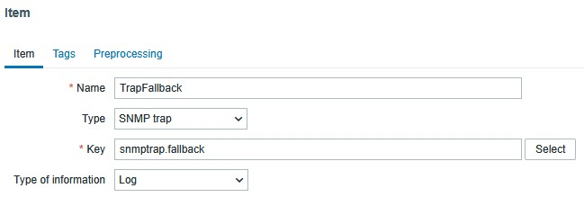
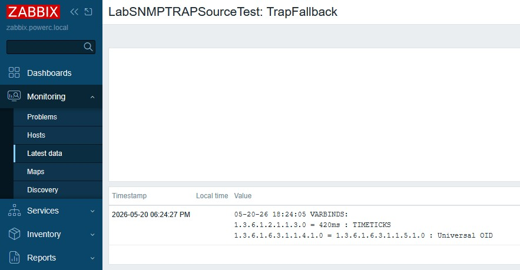

### SNMP Trap/Inform receiver prototype for Zabbix

### Description
Receives TRAP/INFORM SNMP messages form network equipment.  
Functionality:  

- Support receiving SNMP Trap/Inform messages from network equipment (2c and 3 simultaneously).
- To receive SNMP Trap/Inform messages using SNMPv3, the authentication and encryption parameters must be known. Further details are provided below.
- Writes received data to a file that is read by Zabbix.

### Receiving SNMP TRAP/INFORM messages, version 3
Since SNMPv3 messages are typically encrypted, messages must be decrypted before being written to the file.  
The following parameters are required:  
- Username
- Authentication protocol (if used)
- Privacy protocol (if used)
- Authentication password
- Privacy password
- Engine ID

The Username and Engine ID are extracted from message without decryption (using special preliminary parser).
The remaining required parameters are retrieved from a storage where they are configured before the receiver is started.
The message is then fully parsed, with authentication verification and decryption performed.
If successful, the data is written to a file, from which it is subsequently retrieved by Zabbix.
Tested with both IPv4 and IPv6 traps.

**Note on Authentication and Encryption**  
SNMPv3 protocol, supports the following security levels:  
- No authentication, no encryption
- Authentication, no encryption
- Authentication and encryption

Encryption can only be used together with authentication, while authentication can be used without encryption.

### Settings
All parameters are specified in the configuration file **settings.json**.  
The **logfile** must exsist, The receiver can also be run on Windows for testing.  
In this case, the file must be created manually and the correct path specified.  
Alternatively, the file name can be specified without a path if the file is located in the same directory as the executable.

Configuration file example:
```json
{
  "logfile": "/var/log/snmptrap/snmptrap.log",
  "timezone": "Europe/Moscow",
  "debugmode": true,
  "users": [
    {
      "username": "testuser1",
      "authproto": "sha",
      "privproto": "aes",
      "auth": "auth12345",
      "priv": "priv12345"
    },
    {
      "username": "testuser1",
      "authproto": "md5",
      "privproto": "aes256a",
      "auth": "authmd512345",
      "priv": "privdes12345",
      "ipaddr": "192.168.0.106"
    },
    {
      "username": "snmpuser192",
      "authproto": "sha",
      "privproto": "aes192a",
      "auth": "auth12345",
      "priv": "priv19212345"
    },
    {
      "username": "snmpuser256256",
      "authproto": "sha256",
      "privproto": "aes256a",
      "auth": "auth25612345",
      "priv": "priv25612345"
    }
  ]
}
```

### A case where the same username is used with different protocols or passwords.

There may be situations where a group of network devices supports the desired SNMPv3 parameters, but there are exceptions.  
For example, suppose SNMPv3 is configured on all your devices with the following parameters:  
Username - snmpusermg  
Authentication protocol - sha  
Privacy protocol  - aes  

However, there is an older switch that supports only MD5/DES.

In this case, you can either create a separate user or add another section to the configuration file and specify the IP address of the device:
```
    {
      "username": "snmpusermg",
      "authproto": "md5",
      "privproto": "des",
      "auth": "authmd512345",
      "priv": "privdes12345",
      "ipaddr": "192.168.0.106"
    }
```
"192.168.0.106" is the IP address of the test switch  

The lookup logic works as follows:  
The receiver first searches for a matching username + IP address combination. If no matching entry is found, it searches by username only.
---
### Testing
You can test the receiver, using **snmpinform** and **snmptrap**.  

### Example

```bash
snmpinform -v 3 -u testuser1 -a sha -A auth12345 -l authPriv -x aes -X priv12345 -e 0x80001f8880f7996d5a41965d69 192.168.0.4 42 coldStart.2
```

```bash
snmptrap -v 3 -u testuser1 -a sha -A auth12345 -l authNoPriv -e 0x80001f8880f7996d5a41965d69 192.168.0.4 42 coldStart.0
```

```bash
snmpinform -v 3 -u snmpuser192 -a sha -A auth12345 -l authPriv -x aes-192 -X priv19212345 -e 0x80001f8880f7996d5a41965d69 192.168.0.4 42 coldStart.2
```

```bash
snmptrap -v 3 -u snmpuser256256 -a sha-256 -A auth25612345 -l authPriv -x aes-256 -X priv25612345 -e 0x80001f8880f7996d5a41965d69 192.168.0.4 42 coldStart.0
```

**Output example**

``` 
    ----------------------------------------------------------
    received trap/inform version: 3 User/Community snmpuser256256
    Source IP: 192.168.0.106
    Message Type: TRAP (No need ACK)
    RequestID:    228778703
    VarBinds:     2
    Boots: 1, Time: 115920501, EngineID 80001f8880f7996d5a41965d69
    Auth protocol: sha256
    Priv protocol: aes256a
    Authenticated message
    Encrypted message
    Message to file: 05-20-26 18:04:05 ZBXTRAP 192.168.0.106 VARBINDS:
    1.3.6.1.2.1.1.3.0 = 420ms : TIMETICKS
    1.3.6.1.6.3.1.1.4.1.0 = 1.3.6.1.6.3.1.1.5.1.0 : Universal OID
    
    ----------------------------------------------------------
```

**Log example**

``` 
05-20-26 18:04:05 ZBXTRAP 192.168.0.106 VARBINDS:
1.3.6.1.2.1.1.3.0 = 420ms : TIMETICKS
1.3.6.1.6.3.1.1.4.1.0 = 1.3.6.1.6.3.1.1.5.1.0 : Universal OID
```

### simple Zabbix configuration example


